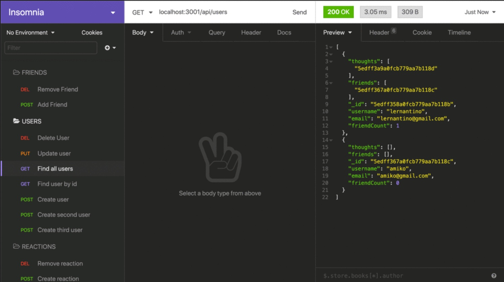

# Note Storage Application

By: Eileen Mitchell

# Git Hub Repo
https://github.com/eileenhlmitchell19/Networking_API

# Walkthrough Video
https://www.youtube.com/watch?v=iWODZn9r30w

# Technologies Used
- MONGODB
- MONGOOSE
- JAVASCRIPT
- EXPRESS

# Description
This application allows users to create an API for social networking to share thoughts, react to friends, thoughts, and create a friend list. This is the back end development of many social platforms that future front end development can be tied into. 

# Known Bugs
- Insomnia Routes arent operational

# Links
- [connection.js](./Develop/config/connection.js)
- [friendControllers.js](./Develop/controllers/friendControllers.js)
- [thoughtControllers.js](./Develop/controllers/thoughtControllers.js)
- [userControllers.js](./Develop/controllers/userControllers.js)
- [models/index.js](./Develop/models/index.js)
- [Thought.js](./Develop/models/Thought.js)
- [friendRoutes.js](./Develop/routes/api/friendRoutes.js)
- [index.js](./Develop/routes/api/index.js)
- [thoughtRoutes.js](./Develop/routes/api/thoughtRoutes.js)
- [userRoutes.js](./Develop/routes/api/userRoutes.js)
- [routes/index.js](./Develop/routes/index.js)
- [.gitignore](./Develop/.gitignore)
- [LICENSE](./Develop/LICENSE)
- [package-lock-json](./Develop/package-lock-json)
- [package.json](./Develop/package.json)
- [README1.md](./Develop/README1.md)
- [server.js](./Develop/server.js)

# Screen Shots

